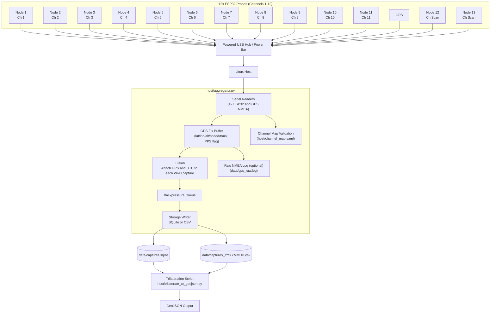

# Wi-Fi Multi-Probe Mapper (12× ESP32 XIAO + GPS/PPS)

A reproducible pipeline to capture 2.4 GHz Wi-Fi management frames simultaneously across channels 1–12 using twelve ESP32 probes connected through a powered USB hub, time-disciplined by GPS with PPS, and fused on a Linux host. Every Wi-Fi capture is annotated with UTC timestamp, latitude, longitude, altitude, speed, and heading, and stored in SQLite or CSV. A downstream script performs motion-aware trilateration and exports GeoJSON.

## Goals

- Deploy 11 fixed Wi-Fi probes, each locked to a specific 2.4 GHz channel (1–11), operating in promiscuous mode.
- Ingest data streams from all probes via USB, along with GPS NMEA input and optional PPS for high-accuracy timestamping.
- Utilize two directional probes, positioned 180° apart, scanning all 11 channels. These help estimate the side of the road or vessel path where an AP is located by comparing RSSI per BSSID, enhancing directional awareness in trilateration.
- Use GPS as the master clock, providing synchronized UTC timestamps and positional context for all probe captures.

Each capture record includes:
- BSSID, SSID, RSSI, Beacon Interval, Node ID, Channel, Frequency, UTC Timestamp, Latitude, Longitude, Altitude, Speed, and Heading.
- Support for SQLite (default) or CSV storage to enable efficient logging in both research and production environments.
- Generate GeoJSON maps of estimated AP locations, using either RSSI-based radius mapping or trilateration that accounts for receiver movement and signal geometry.

## Repository Layout
```
flowchart LR
  A["Data Curator / Aggregator"] --> B["Live Monitor\n(RSSI, Node, BSSID, SSID)"]
  A --> C["SQLite\n(buffered WiFi samples)"]
  B --> D["Left/Right Strength Comparator"]
  C --> E["Segment Buffer\n(per BSSID)"]
  D --> F["Segment Buffer\n(per BSSID)"]
  F --> G["Filter for ≥3 Nodes\n(Fixed)"]
  G --> H["Circle Intersection\nTrilateration"]
  H --> I["Output: Estimated AP Position"]
  I --> J["Trilaterated APs DB"]
  J --> K["GeoJSON Export for QGIS"]
```

```
wifi_promiscuous/
├─ README.md
├─ data/
│  ├─ captures.sqlite
│  ├─ captures_YYYYMMDD.csv
│  └─ gps_raw.log
├─ host/
│  ├─ aggregator.py
│  ├─ trilaterate_to_geojson.py        # (planned)
│  ├─ requirements.txt
│  ├─ config.yaml                      # uses /dev/serial/by-id/* stable paths
│  ├─ channel_map.yaml                 # NodeId → Channel/Frequency/Device
│  └─ schemas/
│     └─ sqlite_schema.sql
├─ scripts/
│  └─ start.sh
└─ firmware/
   └─ esp32_xiao_probe/                # (planned) promiscuous + channel lock + serial out
```

## System Operation (Mermaid)



## Hardware

- 13 × Seeed XIAO ESP32 S3 (or ESP32 variants), each fixed to one channel (1–11).
- 2 x Seed XIAO ESP32 S3 one with directional antena pointing to the left of the vessel and the other to the right at 180 degrees one from the other to help find the side of the vessel where the 2.4Ghs signal is coming from and help the trilateration algorith accuracy.
- Powered USB hub with sufficient current for all probes plus GPS.
- GPS receiver providing NMEA (USB) and PPS.
- Linux host (Debian/Ubuntu/Raspberry Pi OS).

```mermaid
flowchart TD
 subgraph s1["USB HUB WITH POWER"]
        n40["USB MUX"]
  end
 subgraph s2["Raspberry Pi 5"]
        n41["USB BUS"]
        n42["ttyACM0"]
        n43["ttyACM1"]
        n44["ttyACM2"]
        n45["ttyACM3"]
        n46["ttyACM4"]
        n47["ttyACM5"]
        n48["ttyACM6"]
        n49["ttyACM7"]
        n50["ttyACM8"]
        n52["ttyACM9"]
        n53["ttyACM10"]
        n63["ttyACM11"]
        n64["ttyACM12"]
         n55["ttyACM13"]
  end
    C["Node 1"] --> n1["Tune to CH1<br>802.11"]
    n1 --> n5["Capture:<br>BSSID<br>SSID<br>RSSI<br>CH#<br>Frequency"]
    A(["Power"]) --> C & n6["Node 2"] & n9["Node 3"] & n12["Node 4"] & n15["Node 5"] & n18["Node 6"] & n21["Node 7"] & n24["Node 8"] & n27["Node 9"] & n30["Node 10"] & n33["Node 11"] & n39["Node 12"] & n60["Node 13"] & n57["GPS"]
    n6 --> n7["Tune to CH2<br>802.11"]
    n7 --> n8["Capture:<br>BSSID<br>SSID<br>RSSI<br>CH#<br>Frequency"]
    n9 --> n10["Tune to CH3<br>802.11"]
    n10 --> n11["Capture:<br>BSSID<br>SSID<br>RSSI<br>CH#<br>Frequency"]
    n12 --> n13["Tune to CH4<br>802.11"]
    n13 --> n14["Capture:<br>BSSID<br>SSID<br>RSSI<br>CH#<br>Frequency"]
    n15 --> n16["Tune to CH5<br>802.11"]
    n16 --> n17["Capture:<br>BSSID<br>SSID<br>RSSI<br>CH#<br>Frequency"]
    n18 --> n19["Tune to CH6<br>802.11"]
    n19 --> n20["Capture:<br>BSSID<br>SSID<br>RSSI<br>CH#<br>Frequency"]
    n21 --> n22["Tune to CH7<br>802.11"]
    n22 --> n23["Capture:<br>BSSID<br>SSID<br>RSSI<br>CH#<br>Frequency"]
    n24 --> n25["Tune to CH8<br>802.11"]
    n25 --> n26["Capture:<br>BSSID<br>SSID<br>RSSI<br>CH#<br>Frequency"]
    n27 --> n28["Tune to CH9<br>802.11"]
    n28 --> n29["Capture:<br>BSSID<br>SSID<br>RSSI<br>CH#<br>Frequency"]
    n30 --> n31["Tune to CH10<br>802.11"]
    n31 --> n32["Capture:<br>BSSID<br>SSID<br>RSSI<br>CH#<br>Frequency"]
    n33 --> n34["Tune to CH11<br>802.11"]
    n34 --> n35["Capture:<br>BSSID<br>SSID<br>RSSI<br>CH#<br>Frequency"]
    n37["Scan All Channels<br>802.11 every 3 secnds"] --> n38["Capture:<br>BSSID<br>SSID<br>RSSI<br>CH#<br>Frequency"]
    n61["Scan All Channels<br>802.11 every 3 seconds"] --> n62["Capture:<br>BSSID<br>SSIC<br>RSSI<br>CH#<br>Frequency"]
    n39 --> n37
    n5 --> s1
    n8 --> s1
    n11 --> s1
    n14 --> s1
    n17 --> s1
    n20 --> s1
    n23 --> s1
    n26 --> s1
    n29 --> s1
    n32 --> s1
    n35 --> s1
    n38 --> s1
    n40 --> n41
    n41 -- Ch1 --> n42
    n41 -- Ch2 --> n43
    n41 -- Ch3 --> n44
    n41 -- Ch4 --> n45
    n41 -- Ch5 --> n46
    n41 -- Ch6 --> n47
    n41 -- Ch7 --> n48
    n41 -- Ch8 --> n49
    n41 -- Ch9 --> n50
    n41 -- Ch10 --> n52
    n41 -- Ch11 --> n53
    n41 -- Scan --> n63
    n41 -- Scan --> n64
    n60 --> n61
    n62 --> s1
    n57 --> s1
    n41 -- GPS --> n55
    n6@{ shape: rect}
    n9@{ shape: rect}
    n12@{ shape: rect}
    n15@{ shape: rect}
    n18@{ shape: rect}
    n21@{ shape: rect}
    n24@{ shape: rect}
    n27@{ shape: rect}
    n30@{ shape: rect}
    n33@{ shape: rect}
    n57@{ shape: rect}
    n7@{ shape: rect}
    n8@{ shape: rect}
    n10@{ shape: rect}
    n11@{ shape: rect}
    n13@{ shape: rect}
    n14@{ shape: rect}
    n16@{ shape: rect}
    n17@{ shape: rect}
    n19@{ shape: rect}
    n20@{ shape: rect}
    n22@{ shape: rect}
    n23@{ shape: rect}
    n25@{ shape: rect}
    n26@{ shape: rect}
    n28@{ shape: rect}
    n29@{ shape: rect}
    n31@{ shape: rect}
    n32@{ shape: rect}
    n34@{ shape: rect}
    n35@{ shape: rect}
    n37@{ shape: rect}
    n38@{ shape: rect}

  %% Processing
  subgraph Processing["Aggregator Layer"]
    agg["aggregator.py<br>• Reads serial frames<br>• Reads GPS NMEA + PPS<br>• Merges into records"]
  end

  %% Storage
  subgraph Storage["Data Storage"]
    db["SQLite DB: wifi_captures"]
    csv["Optional CSV Export"]
  end

  %% Flow into processing and storage
  n42 & n43 & n44 & n45 & n46 & n47 & n48 & n49 & n50 & n52 & n53 & n55 & n63 & n64 --> agg
  agg --> db
  agg --> csv

  ```

Tip: Use `/dev/serial/by-id/*` stable device IDs to avoid ttyACM renumbering. These are configured in `host/config.yaml`.

## Configuration

`host/config.yaml` drives everything. Example:

```
gps:
  nmea_port: "/dev/serial/by-id/usb-u-blox_AG_-_www.u-blox.com_u-blox_7_-_GPS_GNSS_Receiver-if00"
  nmea_baud: 9600
  use_pps: true
  max_fix_age_ms: 500
  raw_log_enable: true
  raw_log_path: "data/gps_raw.log"

probes:
  1: "/dev/serial/by-id/usb-Espressif_...57:74-if00"
  2: "/dev/serial/by-id/usb-Espressif_...0C:70-if00"
  3: "/dev/serial/by-id/usb-Espressif_...56:2C-if00"
  4: "/dev/serial/by-id/usb-Espressif_...D8:10-if00"
  5: "/dev/serial/by-id/usb-Espressif_...12:2C-if00"
  6: "/dev/serial/by-id/usb-Espressif_...50:9C-if00"
  7: "/dev/serial/by-id/usb-Espressif_...4F:04-if00"
  8: "/dev/serial/by-id/usb-Espressif_...D8:08-if00"
  9: "/dev/serial/by-id/usb-Espressif_...D7:AC-if00"
  10: "/dev/serial/by-id/usb-Espressif_...50:A8-if00"
  11: "/dev/serial/by-id/usb-Espressif_...12:1C-if00"
  12: "/dev/serial/by-id/usb-Espressif_...5E:54-if00"

storage:
  mode: "sqlite"                 # "sqlite" or "csv"
  sqlite_path: "data/captures.sqlite"
  csv_path: "data/captures_{{date}}.csv"

runtime:
  status_interval_s: 5
  queue_max: 10000
  drop_on_backpressure: true
```

Channel ground truth is documented in `host/channel_map.yaml` and validated on startup. Example:

```
channels:
  1: { channel: 1,  frequency_mhz: 2412, device: "/dev/serial/by-id/usb-Espressif_...57:74-if00" }
  2: { channel: 2,  frequency_mhz: 2417, device: "/dev/serial/by-id/usb-Espressif_...0C:70-if00" }
  ...
  12:{ channel: 12, frequency_mhz: 2467, device: "/dev/serial/by-id/usb-Espressif_...5E:54-if00" }
```

## Installation

```
sudo apt update
sudo apt install -y python3-venv gpsd gpsd-clients pps-tools chrony git sqlite3
cd ~/wifi_promiscuous
python3 -m venv .wifienv
source .wifienv/bin/activate
pip install -U pip
pip install -r host/requirements.txt
```

Enable serial access for your user if needed:

```
sudo usermod -a -G dialout $USER
# log out/in or reboot for group change to apply
```

## Start

```
chmod +x scripts/start.sh
./scripts/start.sh
```

You should see:
- Channel-map validation summary.
- Probe open messages for each `/dev/serial/by-id/*` device.
- Status lines like `[status] q=… gps=ok`.
- `data/gps_raw.log` containing timestamped NMEA sentences.

## Storage Schema

SQLite table `wifi_captures`:

```
CREATE TABLE IF NOT EXISTS wifi_captures (
    id INTEGER PRIMARY KEY,
    ts_utc TEXT NOT NULL,
    node_id INTEGER NOT NULL,
    channel INTEGER NOT NULL,
    frequency_mhz INTEGER NOT NULL,
    bssid TEXT NOT NULL,
    ssid TEXT,
    rssi_dbm INTEGER NOT NULL,
    beacon_interval_ms INTEGER,
    gps_lat REAL, gps_lon REAL, gps_alt_m REAL,
    gps_speed_mps REAL, gps_track_deg REAL,
    pps_locked INTEGER DEFAULT 0
);
CREATE INDEX IF NOT EXISTS idx_bssid ON wifi_captures(bssid);
CREATE INDEX IF NOT EXISTS idx_ts ON wifi_captures(ts_utc);
CREATE INDEX IF NOT EXISTS idx_node_ts ON wifi_captures(node_id, ts_utc);
```

CSV header (if `storage.mode: "csv"`):

```
ts_utc,node_id,channel,frequency_mhz,bssid,ssid,rssi_dbm,beacon_interval_ms,gps_lat,gps_lon,gps_alt_m,gps_speed_mps,gps_track_deg,gps_hdop,gps_vdop,pps_locked
```

## Trilateration

`host/trilaterate_to_geojson.py` (planned) will:
- Group rows by BSSID.
- Convert RSSI to range hypotheses with robust loss.
- Use receiver trajectory (position/speed/heading/altitude at capture time).
- Estimate AP positions in 3D (down-weight Z if needed).
- Export GeoJSON Points with metadata (samples_used, estimated error).

## Sanity Checks

- Devices:
  - `ls -l /dev/serial/by-id/`
- GPS live view:
  - `sudo gpsd -n -D 2 -F /var/run/gpsd.sock /dev/serial/by-id/usb-u-blox_...-if00`
  - `cgps -s`
- PPS:
  - `sudo ppstest /dev/pps0`
- Database row count:
  - `sqlite3 data/captures.sqlite 'SELECT COUNT(*) FROM wifi_captures;'`

## Notes

- Use only lawful capture methods; stick to management frames for RF mapping.
- Keep the hub powered and use short, quality cables to minimize serial errors.
