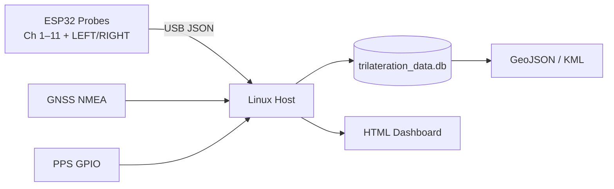
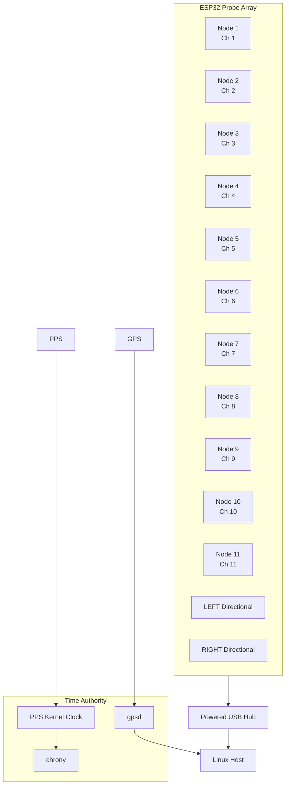
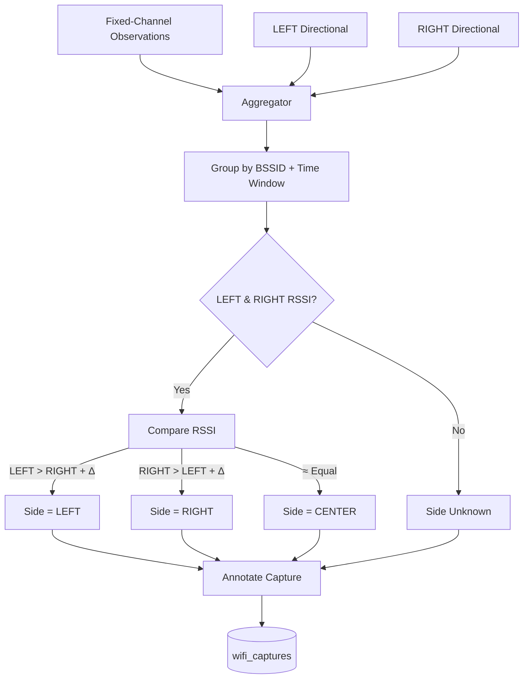
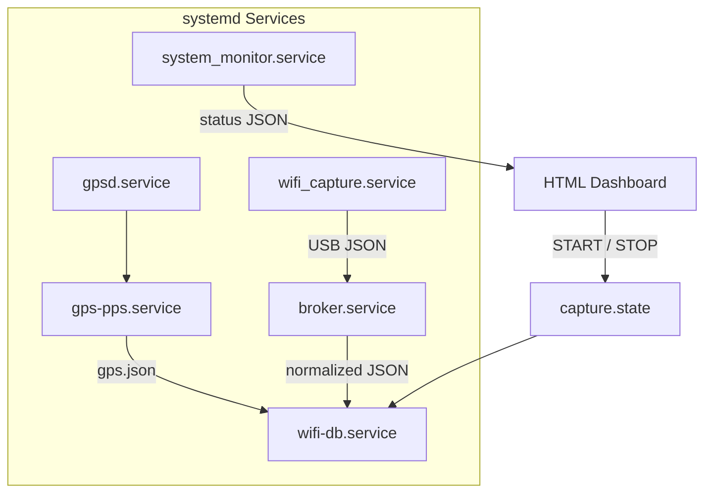

# Wi‑Fi High Speed Scanning Rig

**(ESP32 XIAO Array + GPS/PPS‑Disciplined Linux Host)**

A deterministic, reproducible system for **simultaneous 2.4 GHz Wi‑Fi management‑frame capture** using multiple ESP32 XIAO probes, with **all timing, positioning, and fusion performed centrally on a Linux host disciplined by GPS + PPS**.

The system is designed for **mobile or stationary RF surveying**, directional inference, and later spatial analysis (GeoJSON / KML), while **explicitly avoiding distributed time synchronization** on microcontrollers.

This architecture mirrors professional **SDR, GNSS, and sensor‑fusion systems**.

---

## Core Principles (Non‑Negotiable)

* **ESP32 probes do not own time**

  * They emit **monotonic microsecond counters only**
* **Linux host is the sole time authority**

  * PPS‑disciplined kernel clock
  * GPS provides UTC + motion data
* **All absolute timestamps are assigned on the host**
* **Capture is UI‑controlled**

  * No background capture unless explicitly started
* **State is preserved**

  * Last‑known‑good GPS fix is retained
  * No resets on transient message loss
* **Directional inference is advisory**

  * LEFT / RIGHT probes bias interpretation, not geometry

---

## Operational Overview

At runtime:

1. ESP32 probes capture Wi‑Fi management frames
2. Frames are streamed over USB as JSON
3. Linux host:

   * assigns PPS‑disciplined UTC timestamps
   * fuses GPS position, speed, and heading
   * stores observations in SQLite
4. Optional post‑processing exports GeoJSON for mapping

Capture **does not run by default**.
It only runs when enabled from the HTML dashboard.

---

## High‑Level Data Flow



---

## System Architecture



---

## Capture Control Model

The **database worker always runs**, but **ingestion is gated** by a shared state file.

* `capture.state = STOP` → no database writes
* `capture.state = START` → active ingestion

The HTML UI controls this state.

This avoids:

* restarting services
* corrupting WAL
* losing in‑memory buffers

---

## Repository Layout (Actual)

```text
wifi_promiscuous/
├── data/
│   ├── trilateration_data.db
│   └── wifi.db                # legacy / optional
│
├── host/
│   ├── wifi_capture_service.py
│   ├── broker.py
│   ├── db-worker.py           # main ingestion & fusion
│   ├── gps_service.py         # GPS + PPS → gps.json
│   ├── system_monitor.py
│   └── schema/
│       └── aggregator_schema.sql
│
├── tmp/
│   ├── gps.json
│   ├── capture.state
│   ├── wifi_node_1.json
│   ├── ...
│   ├── wifi_node_11.json
│   ├── wifi_node_LEFT.json
│   └── wifi_node_RIGHT.json
│
├── scripts/
│   ├── start.sh
│   ├── stop.sh
│   └── restart_stack.sh
│
└── /var/www/html/wifi/
    ├── index.html
    ├── db_ctl.php
    ├── css/
    │   └── dashboard.css
    ├── js/
    │   └── dashboard.js
    └── data/ (symlinks to tmp/)
```

---

## Database Model (Operational)

* **wifi_observations** – raw per‑probe observations (append‑only)
* **side_observations** – LEFT / RIGHT burst comparisons
* **wifi_captures** – per‑BSSID aggregated state
* **resolved_locations** – optional derived estimates

---

## Directional LEFT / RIGHT Logic



* Directional probes are advisory only
* Δ avoids noise‑based flipping

---

## Services & systemd Architecture

The system is composed of **long-running systemd services** that remain active at all times, with **runtime behavior gated by state files**, not service restarts.

This design avoids:

* service churn
* WAL corruption
* loss of in-memory buffers
* race conditions

### Service Responsibilities

| Service                  | Purpose                                    |
| ------------------------ | ------------------------------------------ |
| `gpsd.service`           | Reads GNSS NMEA from `/dev/serial0`        |
| `gps-pps.service`        | Generates `gps.json`, validates PPS & fix  |
| `wifi_capture.service`   | Reads ESP32 USB JSON streams               |
| `broker.service`         | Normalizes and fans out capture data       |
| `wifi-db.service`        | Ingests, fuses, and stores data (UI-gated) |
| `system_monitor.service` | Health & telemetry export                  |

### Service Interaction Diagram



**Key points**:

* Services remain running continuously
* `wifi-db.service` checks `capture.state` before every ingest cycle
* UI never restarts services
* GPS remains authoritative even when capture is stopped

---

## GPS & Time Discipline

* GPS NMEA via `/dev/serial0`
* PPS via `/dev/pps0`
* `chrony` disciplines the kernel clock
* `gps_service.py` preserves last‑known‑good fixes

Verified state:

* PPS active
* Mode = 3 (3D fix)
* Valid lat / lon / alt (MSL)
* Reliable timestamps

---

## Dependencies

### System

* Linux (Debian / Ubuntu)
* gpsd
* chrony
* SQLite3
* systemd
* Apache + PHP

### Python

* Python ≥ 3.9
* sqlite3
* json
* statistics
* collections

### Hardware

* 11–13 × ESP32 XIAO
* Directional antennas (LEFT / RIGHT)
* Powered USB hub
* GNSS module with PPS (REYAX RYS352A)
* Raspberry Pi 4/5 or equivalent

---

## Legal / RF Notice

Only **IEEE 802.11 management frames** are captured.
No payloads, no decryption, no association.

Operate only where lawful.

---

## Status

✔ PPS‑disciplined
✔ Centralized time authority
✔ Deterministic ingestion
✔ UI‑controlled capture
✔ Directional inference
✔ Ready for spatial analysis

