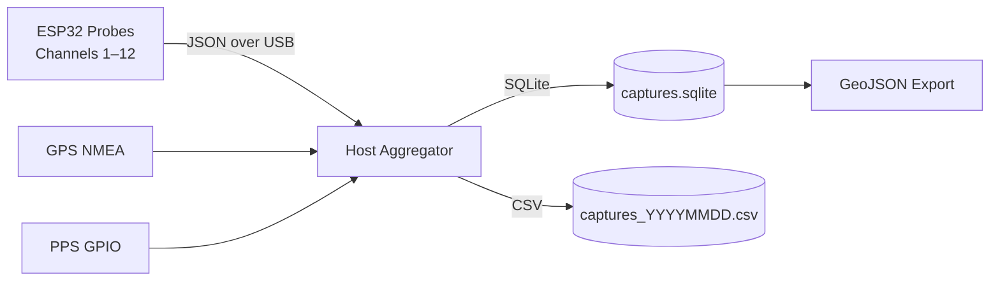
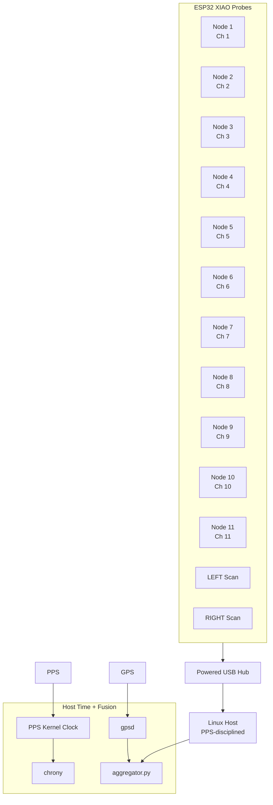
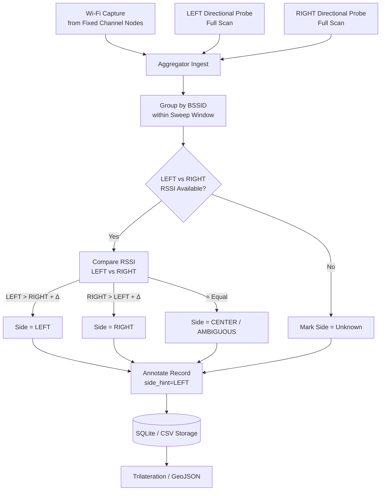

# Wi‑Fi Multi‑Probe Mapper

**(12× ESP32 XIAO + GPS/PPS, Centralized Time Authority)**

A reproducible system for **simultaneous 2.4 GHz Wi‑Fi management‑frame capture** across channels 1–12 using multiple ESP32 XIAO probes, with **GPS + PPS‑disciplined time authority on a Linux host**.

All Wi‑Fi frames are **timestamped centrally on the host** using a sub‑microsecond‑accurate PPS clock, fused with GPS position and motion data, stored in SQLite/CSV, and post‑processed into GeoJSON for spatial analysis.

This architecture intentionally avoids distributed clock synchronization on microcontrollers and instead uses a **single Stratum‑1 time source**.

---

## Design Principles (Authoritative)

* **ESP32 nodes do not discipline time**

  * They emit **monotonic microsecond timestamps only** (`esp_timer_get_time()`).
* **Linux host is the sole time authority**

  * GPS NMEA + PPS → chrony → kernel clock.
* **All absolute timestamps are assigned centrally**

  * Deterministic, monotonic, GPS‑traceable UTC.
* **Scan alignment is logical, not clock‑based**

  * `sweep_id` and `sample_id` provide correlation windows.
* **Directional inference is signal‑based**

  * LEFT/RIGHT probes compare RSSI per BSSID.

This mirrors professional SDR, GNSS, and sensor‑fusion capture systems.

---

## Capture Model

Each Wi‑Fi capture record contains:

### From ESP32

* `node_id`
* `esp_us` — monotonic microseconds since boot
* `sweep_id` — scan epoch identifier
* `sample_id` — per‑sweep sequence number
* `channel`, `frequency_mhz`
* `bssid`, `ssid`
* `rssi_dbm`
* `frame_type` (Beacon, Probe Req, Probe Resp)

### From Host (authoritative)

* `ts_utc` — PPS‑disciplined UTC timestamp
* `gps_lat`, `gps_lon`, `gps_alt_m`
* `gps_speed_mps`, `gps_track_deg`
* `pps_locked` — PPS validity flag

ESP timestamps are retained **only for ordering and latency analysis**.

---

## Repository Layout

```text
wifi_promiscuous/
├─ README.md
├─ data/
│  ├─ captures.sqlite
│  ├─ captures_YYYYMMDD.csv
│  └─ gps_raw.log
├─ host/
│  ├─ aggregator.py
│  ├─ trilaterate_to_geojson.py
│  ├─ requirements.txt
│  ├─ config.yaml
│  ├─ channel_map.yaml
│  └─ schemas/
│     └─ sqlite_schema.sql
├─ scripts/
│  └─ start.sh
└─ firmware/
   ├─ esp32_fixed_channel/
   └─ esp32_directional_scan/
```

---

## High‑Level Data Flow



---

## System Architecture



---

## Hardware

* 13 × Seeed XIAO ESP32-S3

  * 11 fixed-channel probes (Ch 1–11)
  * 2 directional probes (LEFT / RIGHT, full scan)
* Directional antennas (180° opposed)
* Powered USB hub
* **REYAX RYS352A GPS/GNSS module**

  * NMEA over Raspberry Pi UART (`/dev/serial0`)
  * PPS to GPIO for time discipline
* Linux host (Raspberry Pi 4/5, Debian, Ubuntu)

---

## Time Synchronization (Critical)

The host operates as a **Stratum‑1 clock**:

* PPS wired to GPIO (e.g., `dtoverlay=pps-gpio,gpiopin=18`)
* `chrony` uses PPS for high-precision seconds
* GPS NMEA provides coarse UTC date/time + navigation fields (lat/lon/alt/speed/track)
* `gpsd` can parse NMEA from `/dev/serial0` (optional); the host can also parse NMEA directly in `aggregator.py`

### Verification

```bash
# PPS edge present?
sudo ppstest /dev/pps0

# chrony locked to PPS?
chronyc sources -v
chronyc tracking
```

Expected accuracy: **<1 µs**

---

## Configuration

All runtime behavior is controlled by `host/config.yaml`.

```yaml
gps:
  # RYS352A wired to Raspberry Pi UART
  nmea_port: "/dev/serial0"
  nmea_baud: 115200
  use_pps: true
  max_fix_age_ms: 500
  raw_log_enable: true

probes:
  1: "/dev/serial/by-id/usb-Espressif_..."
  2: "/dev/serial/by-id/usb-Espressif_..."
  ...

storage:
  mode: "sqlite"
  sqlite_path: "data/captures.sqlite"

runtime:
  queue_max: 10000
  drop_on_backpressure: true
```

---

## Storage Schema

```sql
CREATE TABLE wifi_captures (
  id INTEGER PRIMARY KEY,
  ts_utc TEXT NOT NULL,
  node_id INTEGER NOT NULL,
  sweep_id INTEGER,
  sample_id INTEGER,
  channel INTEGER,
  frequency_mhz INTEGER,
  bssid TEXT,
  ssid TEXT,
  rssi_dbm INTEGER,
  gps_lat REAL,
  gps_lon REAL,
  gps_alt_m REAL,
  gps_speed_mps REAL,
  gps_track_deg REAL,
  pps_locked INTEGER
);
```

---

## Left / Right Directional Discriminator

The LEFT and RIGHT directional probes scan all channels and do **not** participate in fixed-channel trilateration directly. Instead, they provide **side-of-path discrimination** by comparing RSSI per BSSID within the same sweep window.

The discriminator operates entirely on the host and influences **weighting and labeling** during storage and later trilateration.



**Notes**:

* Δ (delta) is a configurable RSSI threshold to avoid noise-based flips.
* Directional probes are advisory; fixed-channel probes remain authoritative for RF geometry.
* `side_hint` is stored as metadata and used to bias or filter solutions.

---

## Legal & RF Notice

Only IEEE 802.11 **management frames** are captured.
No payloads, no decryption, no association.

Use only where lawful.

---

## Status

✔ GPS‑locked
✔ PPS‑disciplined
✔ Centralized timestamping
✔ Deterministic fusion

This system is **architecturally complete and correct**.
