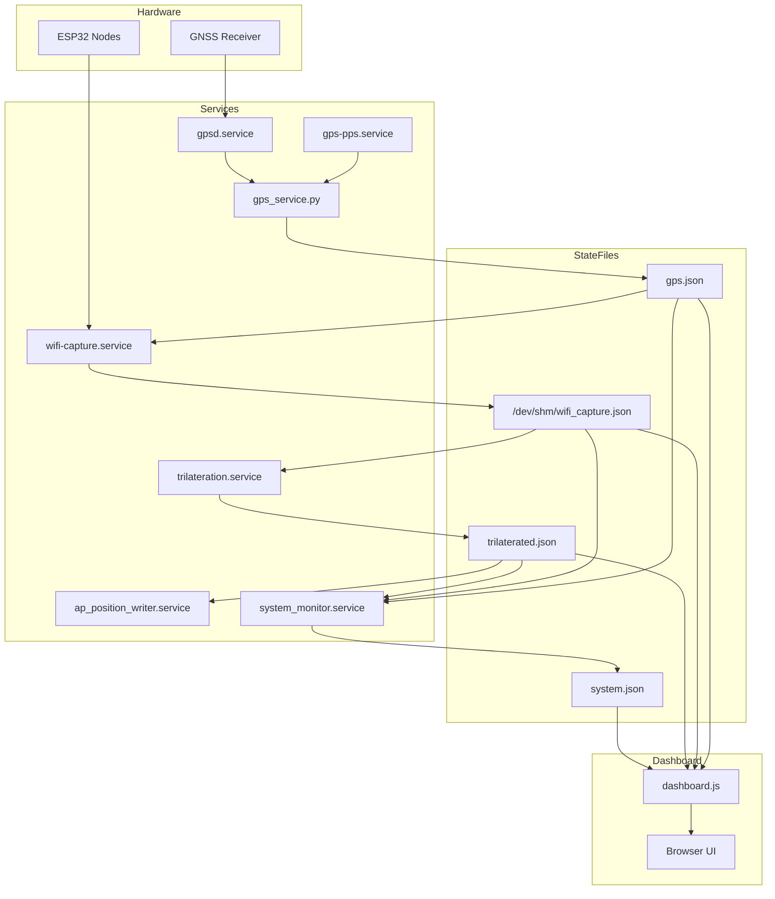
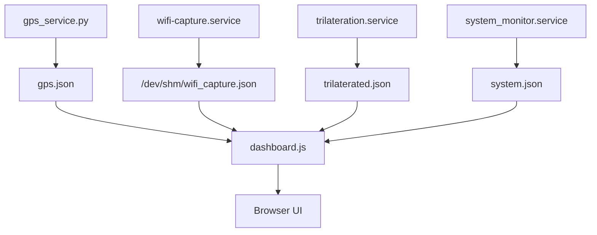

# Dashboard Data Flow (dashboard.js)

This document explains **exactly** how `dashboard.js` reads, aggregates, and displays system data in the Wi‑Fi Promiscuous project.

There is **no direct hardware access** from the dashboard. The dashboard is a **pure consumer** of JSON state files written by background services.

---

## High‑Level Architecture (Current)



---

## Key Design Principle

**dashboard.js never talks to services or devices.**

It only performs:

* `fetch()` over HTTP
* reads pre‑generated JSON files
* renders state already computed elsewhere

If a value is wrong on the dashboard, the **bug is always upstream**.

---

## Files Read by dashboard.js (Current)

| File                         | Written By               | Purpose                                        |
| ---------------------------- | ------------------------ | ---------------------------------------------- |
| `gps.json`                   | `gps_service.py`         | GNSS fix, PPS status, speed, bearing           |
| `/dev/shm/wifi_capture.json` | `wifi-capture.service`   | Raw per‑node Wi‑Fi observations + GPS snapshot |
| `trilaterated.json`          | `trilateration.service`  | Side, confidence, offset geometry              |
| `system.json`                | `system_monitor.service` | CPU, disk, heartbeats, ports                   |

---

## dashboard.js Read Cycle



---

## Heartbeat Logic (Critical)

The dashboard **does not infer liveness**.

It trusts `system_monitor.service` to compute heartbeat ages.

Example from `system.json`:

```json
{
  "heartbeat": {
    "GPS": 1766698123.12,
    "PPS": 1766698123.12,
    "wifi-capture": 1766698122.88,
    "LEFT": 1766698123.01
  }
}
```

`dashboard.js` simply does:

* `now - heartbeat[key]`
* color‑codes based on age thresholds

---

## Why dashboard.js Cannot Break GPS

This is **provably impossible**:

* dashboard.js runs in the browser
* has no file write access
* has no serial access
* has no system calls

If GPS is stuck, the cause is always upstream:

* gpsd / gps‑pps / gps_service
* UART contention
* GNSS configuration
* antenna / RF

---

## Integration with udev + devices.yaml

`devices.yaml` and udev rules ensure:

* deterministic device naming
* no serial probing
* no race conditions

The dashboard remains **unchanged**, regardless of how hardware is wired.

---

## Summary

* dashboard.js is **read‑only**
* all logic happens in services
* JSON files are the contract
* if data is wrong → fix the writer, not the dashboard
