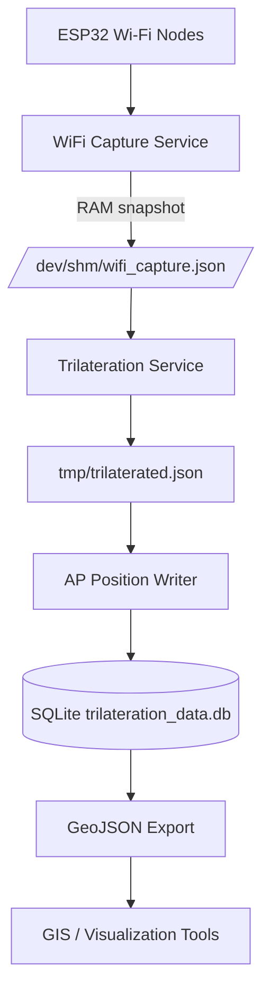
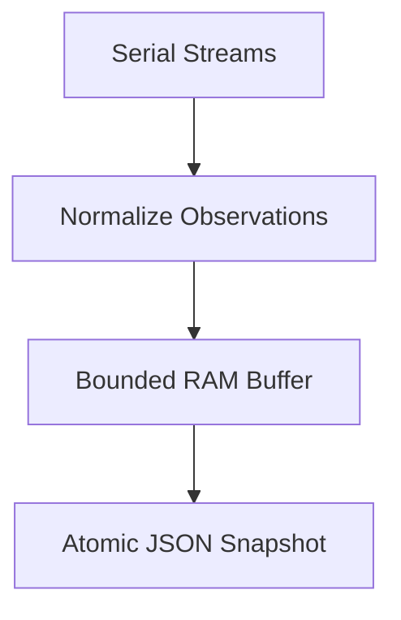
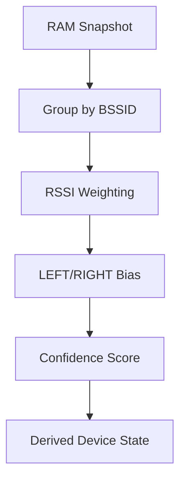
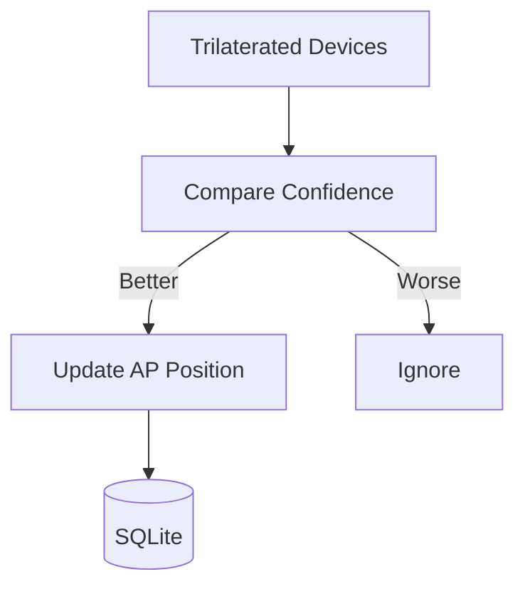
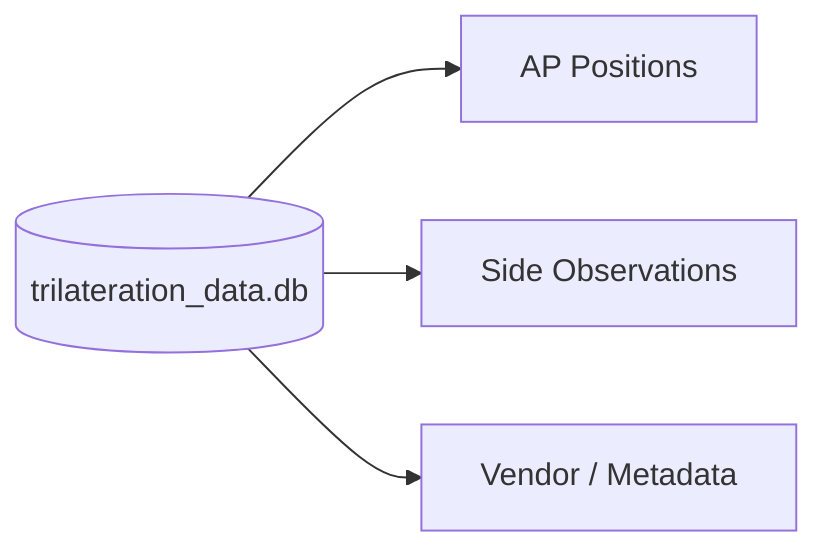
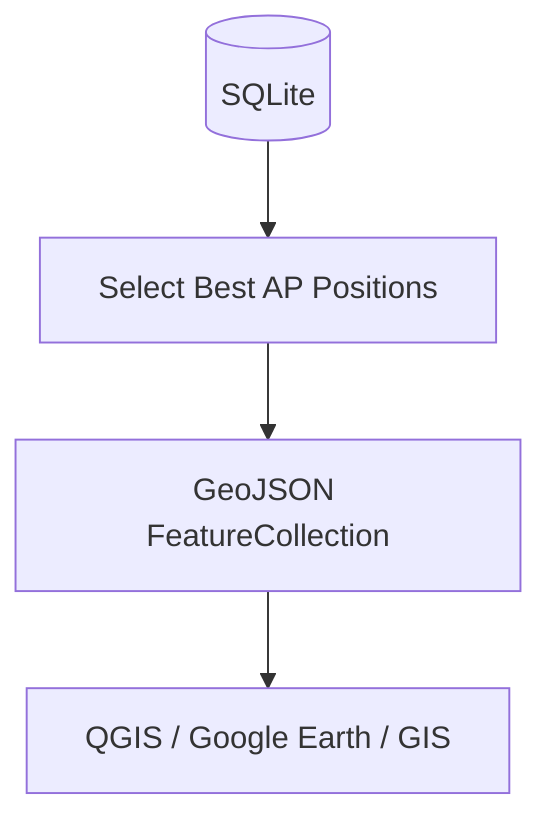

# WiFi Promiscuous Capture & Trilateration Pipeline

This project implements a **real-time Wi‑Fi capture, trilateration, and persistence pipeline** designed for mobile and stationary RF observation (e.g. drive testing, surveying, passive analysis).

The architecture is **modular, fault‑tolerant, and confidence‑driven**, with strict separation between capture, computation, and storage.

---

## High‑Level Flow

---

## Component Responsibilities

### 1. ESP32 Wi‑Fi Nodes

* Fixed‑channel scanners (nodes 1–12)
* Directional sweep scanners (LEFT / RIGHT)
* No storage, no state

---

### 2. WiFi Capture Service (RAM Snapshot)

* Reads ESP32 serial output
* Normalizes raw observations
* Writes **atomic**, bounded snapshots to `/dev/shm`
* **No database access**

Purpose: fast, loss‑tolerant ingestion

---

### 3. Trilateration Service

* Groups observations per BSSID
* Computes:

  * Weighted RSSI
  * Dominant channel
  * Directional bias
  * Confidence percentage
* Outputs derived state

Purpose: signal interpretation (stateless)

---

### 4. AP Position Writer

* Writes to persistent database
* **Confidence‑gated updates only**
* Prevents degradation of stored positions

Purpose: long‑term AP position integrity

---

### 5. SQLite Database

* Stores resolved AP locations
* Maintains history and confidence
* Indexed for lookup and export

---

### 6. GeoJSON Export

* Includes:

  * BSSID
  * SSID (when available)
  * Coordinates
  * Accuracy radius
  * Last‑seen timestamp

Purpose: visualization and offline analysis

---

## Design Principles

* Separation of concerns
* Stateless computation where possible
* Atomic writes only
* RAM‑first ingestion
* Confidence‑driven persistence
* Safe for continuous mobile operation

---

## Use Cases

* Drive testing
* Passive RF mapping
* Wi‑Fi infrastructure surveying
* Side‑of‑road AP discrimination
* Historical AP position tracking

---

## System Status

* Real‑time capture: ✅
* Live trilateration: ✅
* Confidence scoring: ✅
* Persistent AP storage: ✅
* GeoJSON export: ✅

---

## License

(Add as appropriate)
