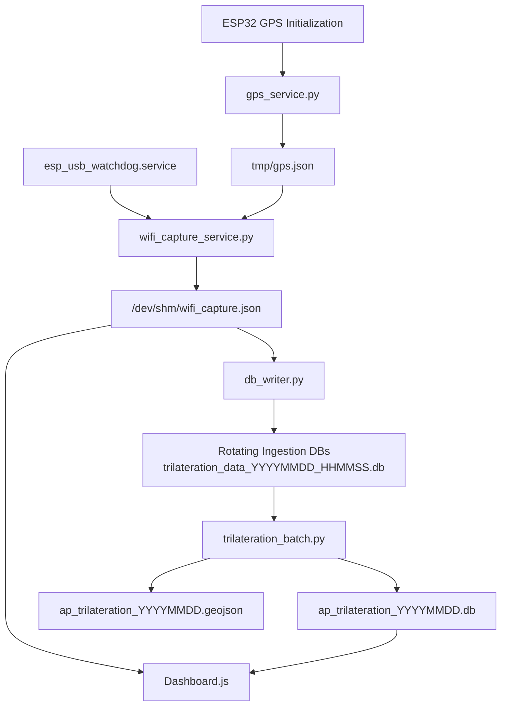

# GPS Subsystem

## Overview

The GPS subsystem provides location, timing, velocity, heading, and satellite quality information for the Wi-Fi trilateration platform.

The system is designed around a Raspberry Pi 5 running a dedicated GPS service that produces a normalized JSON data feed consumed by the Wi-Fi capture and database ingestion pipeline.

The primary objectives of the GPS subsystem are:

* Provide reliable latitude, longitude, and altitude information.
* Provide accurate timestamps for captured Wi-Fi observations.
* Preserve PPS timing accuracy for future correlation and synchronization requirements.
* Supply speed and heading information for identifying moving versus stationary observations.
* Provide satellite quality metrics for filtering low-confidence positioning data during trilateration processing.

---

# Design Evolution

Early versions of the project relied on direct GPS integration through gpsd and direct serial communication between the GPS receiver and the Raspberry Pi.

Although functional, these approaches frequently suffered from:

* Intermittent GPS synchronization failures.
* Serial communication instability.
* GPS lock acquisition problems.
* Inconsistent startup behavior after reboots.
* Difficult recovery from loss-of-fix conditions.
* Occasional serial device detection issues.

After extensive testing, a different architecture was adopted.

An ESP32 was introduced between the GPS receiver and the Raspberry Pi to act as a dedicated GPS interface and serial normalization layer.

This change dramatically improved GPS reliability and startup consistency.

The ESP32 is responsible for:

* GPS initialization.
* GPS serial stabilization.
* Consistent serial communication delivery to the Raspberry Pi.

The Raspberry Pi remains responsible for:

* GPS data processing.
* PPS timing synchronization.
* JSON generation.
* Data ingestion into the Wi-Fi capture pipeline.

---

# PPS Architecture

The ESP32 is not involved in PPS processing.

The PPS (Pulse Per Second) signal from the GPS receiver remains connected directly to a dedicated Raspberry Pi GPIO pin.

Current PPS connection:

GPS Receiver PPS → Raspberry Pi GPIO18 → Linux PPS subsystem

This design preserves full timing accuracy while still benefiting from the ESP32 serial normalization layer.

Advantages include:

* No loss of timing precision.
* Direct kernel PPS support.
* Future support for clock synchronization.
* Future support for timestamp correlation.
* Improved GPS reliability without sacrificing timing performance.

---

# Current Architecture

```text
GPS Receiver
      │
      ▼
ESP32 Serial Interface
      │
      ▼
gps_service.py
      │
      ▼
gps.json
      │
      ▼
wifi_capture_service.py
      │
      ▼
wifi_capture.json
      │
      ▼
db_writer.py
      │
      ▼
Rotating Ingestion Databases
```

PPS Path:

```text
GPS Receiver PPS
      │
      ▼
GPIO18
      │
      ▼
Linux PPS Subsystem
      │
      ▼
gps_service.py
```

---

# gps_service.py

The GPS service is responsible for:

* Reading GPS NMEA data.
* Reading PPS timing information.
* Validating GPS state.
* Normalizing GPS information.
* Producing a unified JSON output.

Output file:

```text
/home/sbejarano/wifi_promiscuous/tmp/gps.json
```

The service continuously updates the file and publishes the latest known GPS state.

---

# GPS Data Fields

The GPS service currently exports:

| Field                 | Description                      |
| --------------------- | -------------------------------- |
| ts_utc                | Service timestamp                |
| gps_time_utc          | GPS-derived UTC time             |
| monotonic_ts          | Monotonic system timestamp       |
| pps_epoch             | PPS timestamp                    |
| pps_ok                | PPS status                       |
| lat                   | Latitude                         |
| lon                   | Longitude                        |
| alt                   | Altitude                         |
| alt_m                 | Altitude in meters               |
| speed_knots           | Speed in knots                   |
| speed_mps             | Speed in meters per second       |
| heading_deg           | Current heading                  |
| heading_valid         | Heading validity                 |
| last_good_heading_deg | Last valid heading               |
| track_deg             | Raw GPS track                    |
| track_deg_stable      | Stabilized track                 |
| vehicle_stationary    | Stationary indicator             |
| gps_valid             | GPS validity state               |
| mode                  | GPS mode                         |
| fix                   | GPS fix description              |
| fix_quality           | NMEA fix quality                 |
| sats                  | Number of satellites             |
| pdop                  | Position dilution of precision   |
| hdop                  | Horizontal dilution of precision |
| vdop                  | Vertical dilution of precision   |

---

# GPS Quality Filtering

Not all GPS observations are equal.

GPS quality metrics are stored together with Wi-Fi observations so that low-quality captures can be filtered during trilateration processing.

Quality indicators include:

* GPS validity.
* Fix quality.
* Satellite count.
* HDOP.
* PDOP.
* VDOP.
* Heading validity.

This allows the ingestion database to store all captures while allowing later batch processing to discard low-confidence records.

---

# Vehicle Motion Detection

The system tracks whether the vehicle is moving or stationary.

This information is used to identify:

* Fixed access points.
* Mobile hotspots.
* Phones operating in hotspot mode.
* Vehicle-based access points.

A stationary GPS position combined with a moving Wi-Fi source can be used to identify potentially mobile devices.

This information becomes particularly useful during batch trilateration analysis.

---

# Database Integration

GPS information is injected into every Wi-Fi capture snapshot.

The following components consume GPS information:

```text
gps_service.py
        │
        ▼
wifi_capture_service.py
        │
        ▼
db_writer.py
```

GPS metadata stored in the ingestion databases includes:

* Latitude.
* Longitude.
* Altitude.
* Heading.
* Speed.
* Fix state.
* Satellite count.
* DOP values.
* PPS status.

This allows future trilateration calculations to operate entirely from database records without requiring access to the original GPS feed.

---

# Reliability Improvements

The introduction of the ESP32 serial normalization layer has produced the following benefits:

* Consistent GPS startup.
* Reliable GPS lock acquisition.
* Elimination of serial synchronization issues.
* Improved recovery after reboots.
* Stable long-duration operation.
* Preservation of PPS timing accuracy.
* Reduced dependency on gpsd.

The resulting architecture has proven significantly more reliable than previous direct GPS-to-Raspberry Pi configurations.

---

# Future Enhancements

Planned improvements include:

* Automatic GPS health monitoring.
* GPS fix aging metrics.
* Multi-constellation monitoring.
* Improved heading stabilization.
* Historical GPS quality statistics.
* PPS-based timestamp correlation.
* Mobile access point detection.
* Advanced trilateration confidence scoring.

The current design provides a stable foundation for all future location-aware processing within the Wi-Fi trilateration platform.


