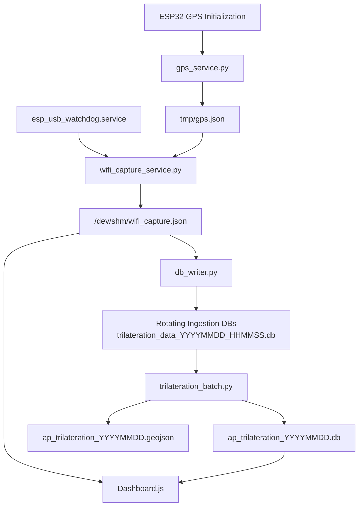

```mermaid
flowchart TD

    gpsinit["ESP32 GPS Initialization"]
    gpssvc["gps_service.py"]
    gpsjson["tmp/gps.json"]

    espwd["esp_usb_watchdog.service"]
    wificap["wifi_capture_service.py"]
    capjson["/dev/shm/wifi_capture.json"]

    dbwriter["db_writer.py"]
    ingestdb["Rotating Ingestion DBs<br/>trilateration_data_YYYYMMDD_HHMMSS.db"]

    batch["trilateration_batch.py"]
    apdb["ap_trilateration_YYYYMMDD.db"]
    geojson["ap_trilateration_YYYYMMDD.geojson"]

    dashboard["Dashboard.js"]

    gpsinit --> gpssvc
    gpssvc --> gpsjson

    espwd --> wificap
    gpsjson --> wificap
    wificap --> capjson

    capjson --> dbwriter
    dbwriter --> ingestdb

    ingestdb --> batch

    batch --> apdb
    batch --> geojson

    capjson --> dashboard
    apdb --> dashboard
```
