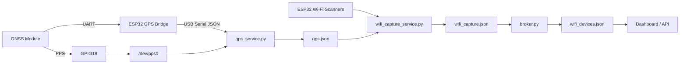

# System Architecture

## Overview

The system is composed of two independent subsystems:

1. GNSS acquisition and distribution
2. Wi-Fi observation and analytics

GNSS data is collected by an ESP32 GPS bridge and normalized by `gps_service.py`.

Wi-Fi observations are collected from multiple ESP32 scanners and processed through a multi-stage pipeline.

Services communicate through JSON state files, allowing components to restart independently and simplifying debugging.

---

## Architecture



---

# GNSS Subsystem

## GNSS Module

The GNSS module provides:

- Latitude and longitude
- Altitude
- Speed
- Heading
- Satellite information
- PPS timing pulses

The GNSS module exposes two independent outputs:

### Navigation Data

Navigation data is sent to the ESP32 GPS bridge over UART.

The ESP32 converts the GNSS stream into JSON and delivers it to the Raspberry Pi over USB serial.

### PPS Timing

The PPS signal is wired directly from the GNSS module to Raspberry Pi GPIO18.

Linux exposes this timing source as:

```text
/dev/pps0
```

This path is completely independent of the ESP32 GPS bridge.

---

## ESP32 GPS Bridge

The ESP32 acts as a transport layer between the GNSS module and the Raspberry Pi.

Responsibilities:

- Receive GNSS navigation data
- Format navigation information as JSON
- Deliver data over USB serial

The Raspberry Pi accesses the bridge through a fixed device path:

```text
/dev/serial/by-id/usb-1a86_USB_Serial-if00-port0
```

Using `/dev/serial/by-id` eliminates dependence on changing `ttyUSB*` assignments.

---

## gps_service.py

`gps_service.py` is responsible for GPS acquisition and normalization.

Responsibilities:

- Read JSON navigation data from the ESP32 GPS bridge
- Read PPS timing information from `/dev/pps0`
- Normalize GPS state
- Publish GPS information for the rest of the system

Output:

```text
tmp/gps.json
```

The file is written atomically so readers never encounter partial updates.

---

## gps.json

`gps.json` is the system-wide GPS state file.

Typical contents include:

```json
{
  "gps_valid": true,
  "lat": 40.1234,
  "lon": -74.1234,
  "speed_mps": 12.5,
  "heading_deg": 182.3,
  "sats": 18,
  "pps_ok": true
}
```

Consumers never communicate directly with GNSS hardware.

Instead, they read the current GPS state from `gps.json`.

---

# Wi-Fi Subsystem

## ESP32 Wi-Fi Scanners

The system uses multiple ESP32-based Wi-Fi scanners.

Examples:

- LEFT
- RIGHT
- node1
- node2
- ...
- node12

Each scanner continuously reports observations such as:

```json
{
  "bssid": "AA:BB:CC:DD:EE:FF",
  "ssid": "CoffeeShop",
  "rssi": -61,
  "channel": 6
}
```

---

## wifi_capture_service.py

`wifi_capture_service.py` is the ingestion layer for Wi-Fi observations.

Responsibilities:

- Read serial data from ESP32 scanners
- Track scanner status
- Read GPS metadata from `gps.json`
- Aggregate observations into a single state file

Output:

```text
/dev/shm/wifi_capture.json
```

The output contains:

- GPS metadata
- Scanner health information
- Raw Wi-Fi observations

---

## wifi_capture.json

Example structure:

```json
{
  "ts": 1717966000.5,

  "gps": {},

  "scanner_status": {},

  "observations": []
}
```

This file represents the complete system snapshot at a point in time.

---

## broker.py

`broker.py` consumes:

```text
/dev/shm/wifi_capture.json
```

Responsibilities:

- Track active devices
- Maintain observation history
- Compute average RSSI
- Determine LEFT vs RIGHT directionality
- Filter hidden SSIDs
- Apply deny lists
- Remove stale observations

Output:

```text
tmp/wifi_devices.json
```

---

## wifi_devices.json

Example:

```json
{
  "ts": 1717966000.5,
  "devices": [
    {
      "bssid": "AA:BB:CC:DD:EE:FF",
      "ssid": "CoffeeShop",
      "rssi": -61,
      "channel": 6,
      "side": "LEFT"
    }
  ]
}
```

This file represents the processed device view used by dashboards and APIs.

---

# Device Identity Management

## udev Rules

All ESP32 devices use fixed names derived from USB serial numbers.

Examples:

```text
/dev/esp-left
/dev/esp-right

/dev/esp-node1
/dev/esp-node2
...
/dev/esp-node12
```

This eliminates:

- ttyACM enumeration changes
- device discovery logic
- startup race conditions

---

## devices.yaml

`devices.yaml` maps logical roles to physical devices.

Example:

```yaml
ports:
  LEFT: /dev/esp-left
  RIGHT: /dev/esp-right
```

or

```yaml
ports:
  node1: /dev/esp-node1
  node2: /dev/esp-node2
```

Applications operate on logical node names rather than kernel-assigned device identifiers.

---

# Design Principles

## Single Ownership

Each hardware interface has one owner.

| Resource | Owner |
|-----------|---------|
| GNSS Navigation Data | gps_service.py |
| PPS Timing | gps_service.py |
| Wi-Fi Scanner Data | wifi_capture_service.py |
| Device Analytics | broker.py |

This prevents resource contention and simplifies debugging.

---

## File-Based Interfaces

Services communicate through JSON state files.

Files used throughout the system:

```text
tmp/gps.json
/dev/shm/wifi_capture.json
tmp/wifi_devices.json
```

Benefits:

- Easy inspection
- Independent service restarts
- Clear boundaries between components
- Simple operational model

---

## Deterministic Device Naming

Hardware devices use fixed identifiers generated by udev.

Benefits:

- No probing
- No scanning
- No discovery logic
- Predictable startup behavior
- Appliance-grade reliability
