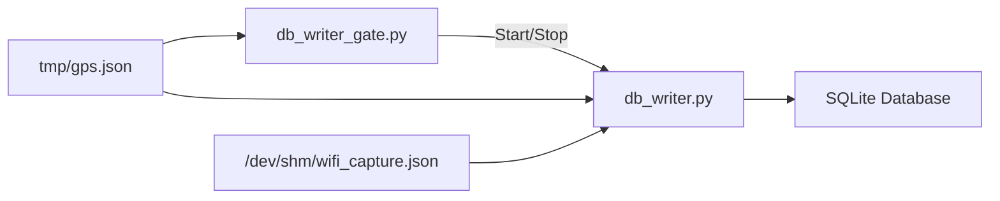
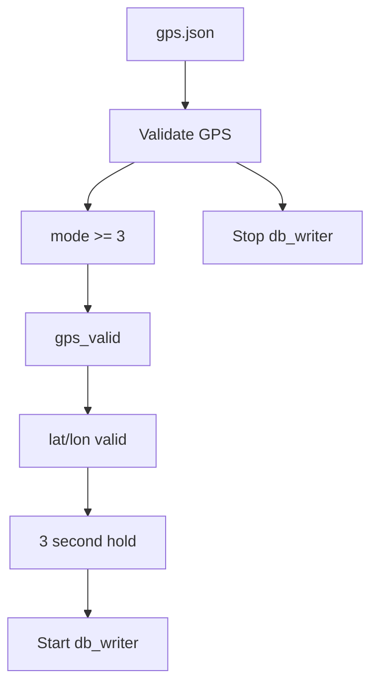
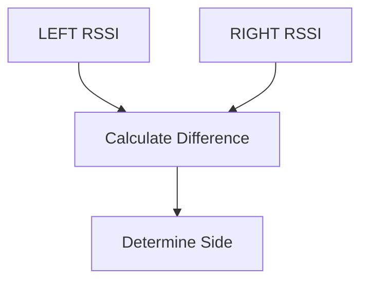
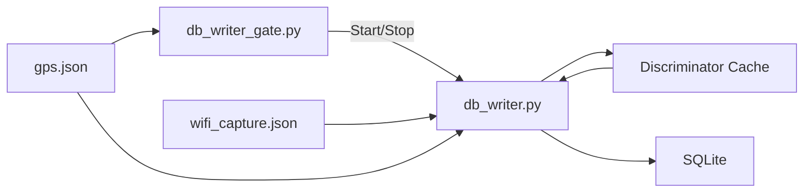

# Database Writer Architecture

## Overview

The database subsystem consists of two independent services:

1. `db_writer_gate.py`
2. `db_writer.py`

The gate service controls whether database writes are allowed.

The writer service converts Wi-Fi observations into enriched SQLite records.

The primary design rule is:

> No valid GPS fix = no database writes.

This guarantees that every stored observation contains valid geographic coordinates.

---

# Architecture



---

# db_writer_gate.py

## Purpose

`db_writer_gate.py` acts as a supervisor.

It does not write any database records.

Its only responsibility is deciding whether `db_writer.py` should be running.

---

## Input

Reads:

```text
tmp/gps.json
```

Every:

```text
1 second
```

---

## GPS Lock Requirements

The writer is allowed to run only when all of the following conditions are true:

### 3D Fix

```python
mode >= 3
```

Meaning:

| Mode | Meaning |
|--------|----------|
| 1 | No Fix |
| 2 | 2D Fix |
| 3 | 3D Fix |

Only mode 3 is accepted.

---

### GPS Valid

```python
gps_valid == true
```

---

### Latitude Present

```python
lat != 0
```

---

### Longitude Present

```python
lon != 0
```

---

## Lock Hold Timer

A valid lock must remain stable for:

```text
3 seconds
```

before the database writer is started.

This prevents startup oscillation caused by unstable GPS acquisition.

---

## Outputs

When GPS becomes valid:

```bash
systemctl start db_writer.service
```

When GPS becomes invalid:

```bash
systemctl stop db_writer.service
```

---

## Gate Logic



---

# db_writer.py

## Purpose

`db_writer.py` converts Wi-Fi observations into persistent SQLite records.

Responsibilities:

- Read Wi-Fi observations
- Verify GPS validity
- Aggregate observations
- Apply LEFT/RIGHT directional state
- Store results in SQLite

---

# Inputs

## GPS State

Reads:

```text
tmp/gps.json
```

Provides:

- Latitude
- Longitude
- Altitude
- Speed
- Heading
- GPS quality metrics

---

## Wi-Fi Snapshot

Reads:

```text
/dev/shm/wifi_capture.json
```

Produced by:

```text
wifi_capture_service.py
```

Contains:

- GPS metadata
- Scanner status
- Wi-Fi observations

---

# GPS Safety Rule

Even after the gate starts the writer, GPS validity is checked again.

If:

```python
gps_valid == false
```

then:

```python
return []
```

No database rows are generated.

This provides a second layer of protection.

---

# Directional Processing

The system has two special scanner nodes:

```text
LEFT
RIGHT
```

These are not stored as database rows.

Instead they are used as directional references.

---

## Discriminator Cache

Directional observations are stored in memory:

```python
DiscriminatorCache
```

for:

```text
12 seconds
```

The cache tracks:

```text
LEFT RSSI
RIGHT RSSI
Timestamp
```

per:

```text
(BSSID, Channel)
```

---

## Example

Directional scanners observe:

```text
LEFT  = -52 dBm
RIGHT = -72 dBm
```

The cache learns:

```text
Device is on LEFT side
```

Later:

```text
node5 observes same BSSID
```

The resulting database record becomes:

```text
side = LEFT
left_rssi = -52
right_rssi = -72
differential = 20
```

without storing the original LEFT and RIGHT observations.

---

## Direction Determination



Rules:

```text
LEFT - RIGHT > 4 dB  -> LEFT
RIGHT - LEFT > 4 dB -> RIGHT
otherwise           -> OMNI
```

---

# Duplicate Protection

The Wi-Fi capture file contains a rolling buffer.

Without protection the same observation could be written repeatedly.

Each observation generates a unique key:

```text
(node,
 bssid,
 channel,
 rssi,
 timestamp)
```

Previously-seen observations are skipped.

---

# Aggregation

Observations are grouped by:

```text
(BSSID, Channel)
```

For each group:

Computed fields include:

- Sample count
- Average RSSI
- Median RSSI
- Dominant channel
- Frequency

---

# Database Output

Records are written into:

```text
wifi_captures
```

SQLite table.

Stored information includes:

## Wi-Fi

- BSSID
- SSID
- Average RSSI
- Median RSSI
- Channel
- Frequency

## GPS

- Latitude
- Longitude
- Altitude
- Speed
- Heading
- PDOP
- HDOP
- VDOP

## Directionality

- LEFT RSSI
- RIGHT RSSI
- Differential
- Side
- Side confidence

## Timing

- GPS timestamp
- Observation timestamp
- Last seen timestamp

---

# Database Rotation

The database rotates when either:

## UTC Day Changes

Example:

```text
2026-06-09
→
2026-06-10
```

---

## Size Exceeds Limit

```text
100 MB
```

---

## Database Naming

Example:

```text
trilateration_data_20260609_140012.db
```

A symlink is maintained:

```text
trilateration_data_latest.db
```

pointing to the active database.

---

# Complete Data Flow



---

# Summary

## db_writer_gate.py

Inputs:

- `gps.json`

Outputs:

- Starts `db_writer.service`
- Stops `db_writer.service`

Purpose:

- Enforce GPS lock requirements

---

## db_writer.py

Inputs:

- `gps.json`
- `wifi_capture.json`

Outputs:

- SQLite databases
- Rotated database files
- Latest database symlink

Purpose:

- Convert Wi-Fi observations into georeferenced records
- Apply directional intelligence
- Persist data for trilateration and analysis
