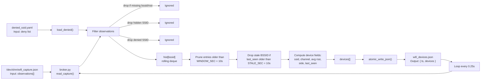
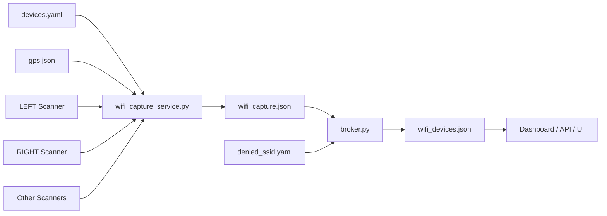
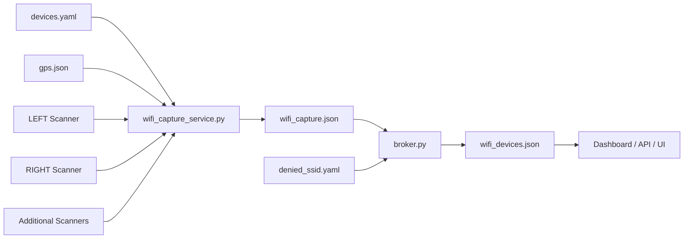

# broker.py

# wifi_capture_service.py



---

## How It Works

 raw observations into a clean list of active Wi-Fi devices.
**Ensures ESP32 USB capture nodes stay responsive by detecting stalled data streams, safely resetting only the affected USB devices, and exposing status for dashboards.**
# WiFi Capture Service

## Overview

`wifi_capture_service.py` is the raw data ingestion layer of the WiFi monitoring system.

Its responsibility is to:

1. Read WiFi observations from one or more serial-connected scanner devices.
2. Read GPS metadata from the GPS service.
3. Combine scanner observations and GPS information into a single shared snapshot.
4. Continuously write that snapshot to `wifi_capture.json`.

The service performs **no filtering, averaging, deduplication, or device tracking**. Those tasks are handled later by `broker.py`.

---

## Architecture



---

## Inputs

### Scanner Configuration

The service reads scanner configuration from:

```text
devices.yaml
```

This file defines:

* Scanner node names
* Serial device paths
* Baud rates

Example:

```yaml
ports:
  LEFT: /dev/ttyUSB0
  RIGHT: /dev/ttyUSB1
```

---

### GPS Metadata

The service reads GPS information from:

```text
tmp/gps.json
```

GPS data is treated as metadata only.

WiFi capture continues even when:

* GPS is unavailable
* GPS has no fix
* GPS service is restarting
* `gps.json` is missing

---

### Scanner Data

Each scanner continuously sends JSON packets over a serial connection.

Example:

```json
{
  "bssid": "AA:BB:CC:DD:EE:FF",
  "ssid": "CoffeeShop",
  "rssi": -61,
  "channel": 6
}
```

---

## Startup Sequence

### 1. Load Scanner Configuration

At startup the service reads `devices.yaml` and creates a list of scanner definitions.

Example:

```python
[
    {
        "node": "LEFT",
        "port": "/dev/ttyUSB0",
        "baud": 115200
    },
    {
        "node": "RIGHT",
        "port": "/dev/ttyUSB1",
        "baud": 115200
    }
]
```

---

### 2. Create Capture Bus

The service creates a shared in-memory bus:

```python
bus = CaptureBus()
```

The bus contains:

* A rolling observation buffer
* Scanner status information
* Thread synchronization locks

Observations are stored in:

```python
deque(maxlen=2000)
```

When the buffer reaches capacity, the oldest observations are automatically discarded.

---

### 3. Start Scanner Threads

One thread is created for each configured scanner.

Example:

```text
LEFT Scanner  -> Thread
RIGHT Scanner -> Thread
```

Each scanner thread operates independently.

---

## Scanner Thread Operation

Each thread continuously attempts to open its assigned serial port.

Example:

```python
serial.Serial(dev, baud)
```

If a scanner disconnects or restarts, the thread:

1. Marks the scanner as disconnected.
2. Records the error.
3. Waits briefly.
4. Attempts to reconnect.

This allows the service to recover automatically from hardware failures.

---

## Packet Processing

Each scanner thread reads JSON packets line-by-line.

Example packet:

```json
{
  "bssid": "AA:BB:CC:DD:EE:FF",
  "ssid": "CoffeeShop",
  "rssi": -61,
  "channel": 6
}
```

The service validates:

* BSSID exists
* RSSI exists

Packets missing required fields are ignored.

---

## Observation Creation

Valid packets are normalized into observations.

Example:

```json
{
  "ts": 1717966000.5,
  "node": "LEFT",
  "bssid": "AA:BB:CC:DD:EE:FF",
  "ssid": "CoffeeShop",
  "rssi": -61,
  "channel": 6,
  "frequency": 2437
}
```

The observation is then stored in the shared CaptureBus.

---

## Scanner Status Tracking

Each scanner periodically updates its status.

Example:

```json
{
  "LEFT": {
    "port": "/dev/ttyUSB0",
    "connected": true,
    "last_error": null,
    "last_seen": 1717966000
  }
}
```

This information allows downstream services and dashboards to determine scanner health.

---

## Main Processing Loop

The main thread runs continuously.

Every 200 milliseconds it performs the following steps:

### Read GPS Data

```python
gps = read_gps()
```

The service attempts to read the latest GPS information.

If GPS is unavailable, a default GPS block is generated.

---

### Build GPS Block

GPS data is normalized into a consistent structure.

Even when GPS is unavailable, fields remain present:

```json
{
  "gps_valid": false,
  "gps_fix": "NO GPS DATA"
}
```

This guarantees a stable schema for downstream consumers.

---

### Capture Snapshot

The service captures a thread-safe snapshot of:

* Current observations
* Scanner status

```python
observations, scanner_status = bus.snapshot()
```

---

### Build Payload

The output payload combines:

* Timestamp
* GPS metadata
* Scanner status
* WiFi observations

Example:

```json
{
  "ts": 1717966000.5,
  "gps": {},
  "scanner_status": {},
  "observations": []
}
```

---

### Write Output

The payload is written to:

```text
/dev/shm/wifi_capture.json
```

using an atomic write operation.

Process:

```text
wifi_capture.json.tmp
        ↓
os.replace()
        ↓
wifi_capture.json
```

This guarantees readers never encounter:

* Partial writes
* Truncated files
* Invalid JSON

---

## Output Format

The generated file contains:

```json
{
  "ts": 1717966000.5,

  "gps": {
    "...": "..."
  },

  "scanner_status": {
    "...": "..."
  },

  "observations": [
    {
      "node": "LEFT",
      "bssid": "AA:BB:CC:DD:EE:FF",
      "ssid": "CoffeeShop",
      "rssi": -61,
      "channel": 6
    }
  ]
}
```

---

## Relationship to broker.py

`wifi_capture_service.py` produces raw observations.

`broker.py` consumes those observations and performs higher-level processing:

* Hidden SSID filtering
* Deny-list filtering
* Device tracking
* RSSI averaging
* Direction determination (LEFT vs RIGHT)
* Active device aging

Pipeline:

```text
Scanners + GPS
        ↓
wifi_capture_service.py
        ↓
wifi_capture.json
        ↓
broker.py
        ↓
wifi_devices.json
        ↓
Dashboard / API
```

---

## Summary

`wifi_capture_service.py` serves as the system's ingestion layer. It merges scanner feeds and GPS metadata into a single, continuously updated capture file. The service is intentionally simple, resilient, and stateless, allowing downstream components such as `broker.py` to perform filtering, analytics, and device tracking.
