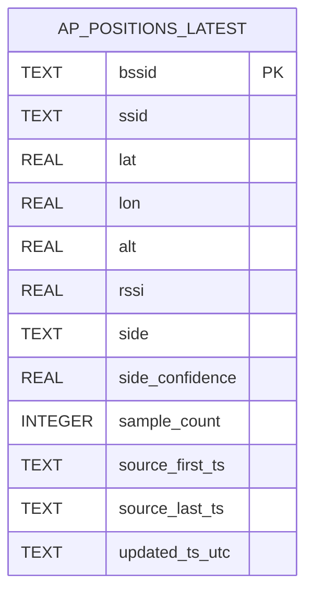
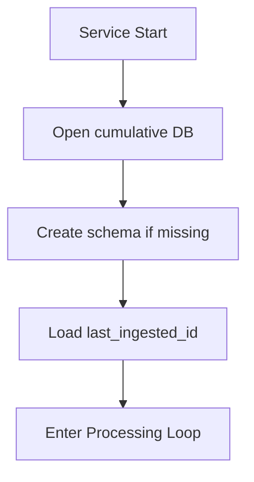
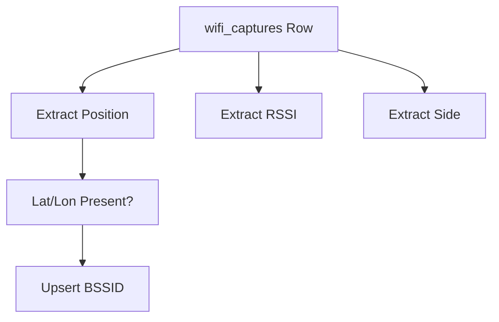
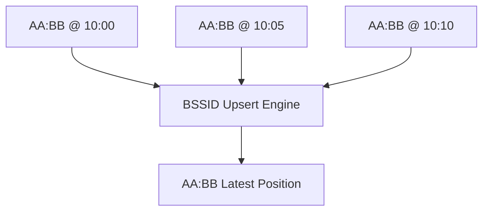
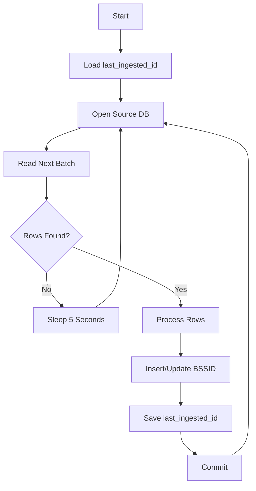
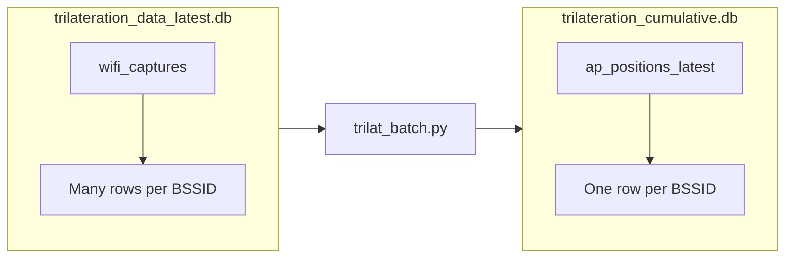

# Trilateration Consolidator Service

## Overview

The Trilateration Consolidator is responsible for transforming the rolling observation database into a cumulative access-point location database.

The ingestion database contains many observations for the same Wi-Fi access point over time.

The consolidator continuously processes new observations and maintains a single continuously-updated record for each BSSID.

---

## Purpose

Convert:

```text
Millions of Wi-Fi observations
```

into:

```text
One continuously updated location record per BSSID
```

The service preserves:

- Latest position
- Signal information
- Directionality
- Lifetime sample counts
- First seen timestamp
- Last seen timestamp
- Update history

---

# System Position


---

# Inputs

## Source Database

Reads:

```text
data/trilateration_data_latest.db
```

This database is maintained by:

```text
db_writer.py
```

---

## Source Table

Reads:

```sql
wifi_captures
```

Expected fields:

```text
id
bssid
ssid

est_lat
est_lon
est_alt

or

gps_lat_min
gps_lat_max
gps_lon_min
gps_lon_max

avg_rssi
median_rssi

side
side_confidence

sample_count

ts_utc
```

The service automatically adapts to schema differences.

---

# Outputs

Writes:

```text
data/trilateration_cumulative.db
```

Contains:

```sql
ap_positions_latest
```

One row per BSSID.

---

# Destination Schema



---

# State Tracking

The service maintains:

```sql
service_state
```

Used to store:

```text
last_ingested_id
```

This allows the service to resume exactly where it left off after a restart.

---

# Startup Sequence

When the service starts:

1. Open destination database
2. Create schema if missing
3. Load last processed source row ID
4. Begin batch processing loop

---

## Startup Flow



---

# Processing Loop

The service runs forever.

Every:

```text
5 seconds
```

it:

1. Opens source database
2. Discovers source schema
3. Reads next batch
4. Consolidates BSSID data
5. Updates cumulative database
6. Saves progress marker

---

# Batch Processing

Rows are processed in batches:

```python
BATCH_SIZE = 5000
```

Example query:

```sql
SELECT ...
FROM wifi_captures
WHERE id > last_ingested_id
ORDER BY id
LIMIT 5000
```

This keeps memory usage predictable.

---

# Dynamic Schema Detection

Before reading rows the service inspects:

```sql
PRAGMA table_info(wifi_captures)
```

This allows compatibility with multiple schema versions.

---

## Preferred Position Fields

If available:

```text
est_lat
est_lon
est_alt
```

are used.

---

## Fallback Position Fields

If estimated positions do not exist:

```text
gps_lat_min
gps_lat_max

gps_lon_min
gps_lon_max
```

are used.

Position is calculated as:

```text
(gps_lat_min + gps_lat_max) / 2

(gps_lon_min + gps_lon_max) / 2
```

---

# Data Selection Pipeline



Rows lacking latitude or longitude are discarded.

---

# Consolidation Logic

The service converts:

```text
Many observations
```

into:

```text
One BSSID record
```

---

## Example

Source observations:

| id | bssid | lat | lon | ts |
|----|--------|------|------|------|
| 1 | AA:BB | 40.1 | -74.1 | 10:00 |
| 2 | AA:BB | 40.2 | -74.2 | 10:05 |
| 3 | AA:BB | 40.3 | -74.3 | 10:10 |

Destination record:

| bssid | lat | lon | source_last_ts |
|--------|------|------|----------------|
| AA:BB | 40.3 | -74.3 | 10:10 |

---

## Consolidation Flow



---

# Upsert Strategy

The destination table uses:

```sql
ON CONFLICT(bssid)
```

Behavior:

```text
BSSID exists?
    YES -> Update existing row
    NO  -> Insert new row
```

---

# Freshness Rules

The most recent observation wins.

Decision field:

```text
source_last_ts
```

If incoming timestamp is newer:

Replace:

```text
lat
lon
alt
rssi
side
side_confidence
```

Otherwise:

```text
Keep existing values
```

---

# Sample Count Accumulation

Unlike location fields:

```text
sample_count
```

is accumulated over time.

Example:

```text
Existing: 200

Incoming: 15

Result: 215
```

This becomes a lifetime observation count.

---

# Timestamp Tracking

Each BSSID stores:

## First Seen

```text
source_first_ts
```

Earliest observation ever seen.

---

## Last Seen

```text
source_last_ts
```

Most recent observation ever seen.

---

## Last Updated

```text
updated_ts_utc
```

When the consolidator last modified the row.

---

# State Persistence

After each successful batch:

```text
last_ingested_id
```

is updated.

Example:

```text
Processed row ID 4250000
```

Stored in:

```sql
service_state
```

Next restart resumes from:

```text
4250001
```

rather than reprocessing the entire database.

---

# Complete Processing Flow



---

# Database Relationships



---

# Inputs and Outputs Summary

## Inputs

### Database

```text
trilateration_data_latest.db
```

### Table

```text
wifi_captures
```

### State

```text
service_state.last_ingested_id
```

---

## Outputs

### Database

```text
trilateration_cumulative.db
```

### Table

```text
ap_positions_latest
```

### State

```text
service_state.last_ingested_id
```

---

# Design Philosophy

The ingestion database is treated as a continuously growing event log.

The cumulative database is treated as a continuously improving access-point catalog.

The consolidator sits between them and converts:

```text
Observation History
```

into:

```text
Current Best Known AP Location
```

for every BSSID ever observed.
