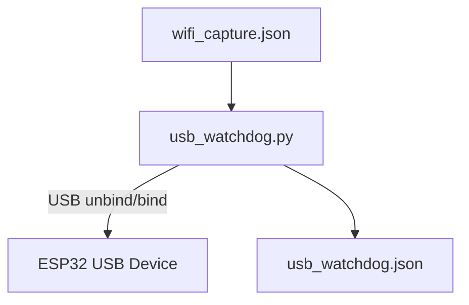

# ESP USB Watchdog

## Purpose

A lightweight watchdog daemon that **monitors ESP32 Wi‑Fi capture nodes** and **automatically resets stalled USB devices**.

---

## Data Flow

---

## How It Works

1. **Reads capture state**
   Continuously reads `wifi_capture.json`, which contains per‑node timestamps written by the Wi‑Fi capture service.

2. **Detects stalls**
   A node is considered stalled when:

   * Last timestamp is older than **10 seconds**
   * The node has not been reset within the **30‑second cooldown**

3. **Maps node → USB device**
   Logical node IDs are mapped to `/dev/esp-*` device names.

4. **Performs USB reset**
   Uses `udevadm` to identify the USB bus and performs a **hard unbind/bind reset** on the affected device only.

5. **Publishes watchdog state**
   Writes `usb_watchdog.json` with:

   * Last time data was seen per node
   * Last USB reset time per node

---

## What It Does *Not* Do

* No direct ESP32 communication
* No serial data reading
* No GPS interaction
* No service restarts

---

## One‑Line Summary

**Ensures ESP32 USB capture nodes stay responsive by detecting stalled data streams, safely resetting only the affected USB devices, and exposing status for dashboards.**
