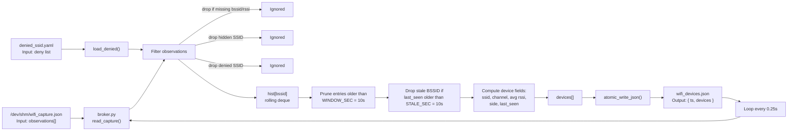

# broker.py

```mermaid

flowchart LR
    A["/dev/shm/wifi_capture.json<br/>Input: observations[]"] --> B["broker.py<br/>read_capture()"]

    D["denied_ssid.yaml<br/>Input: deny list"] --> C["load_denied()"]
    C --> E["Filter observations"]

    B --> E

    E -->|drop if missing bssid/rssi| X1["Ignored"]
    E -->|drop hidden SSID| X2["Ignored"]
    E -->|drop denied SSID| X3["Ignored"]

    E --> F["hist[bssid]<br/>rolling deque"]
    F --> G["Prune entries older than<br/>WINDOW_SEC = 10s"]
    G --> H["Drop stale BSSID if<br/>last_seen older than STALE_SEC = 10s"]

    H --> I["Compute device fields:<br/>ssid, channel, avg rssi,<br/>side, last_seen"]
    I --> J["devices[]"]

    J --> K["atomic_write_json()"]
    K --> L["wifi_devices.json<br/>Output: { ts, devices }"]

    M["Loop every 0.25s"] --> B
    L --> M
```
# wifi_capture_service.py

```mermaid
flowchart LR

    CFG[devices.yaml\nScanner Configuration] --> LP[load_ports]

    GPS[tmp/gps.json\nGPS Metadata] --> RG[read_gps]

    LP --> T1[capture_thread LEFT]
    LP --> T2[capture_thread RIGHT]
    LP --> TN[capture_thread Additional Scanners]

    S1[Serial Port JSON] --> T1
    S2[Serial Port JSON] --> T2
    SN[Serial Port JSON] --> TN

    T1 --> BUS[CaptureBus]
    T2 --> BUS
    TN --> BUS

    BUS --> SNAP[snapshot]

    RG --> GPSBLK[build_gps_block]

    SNAP --> PAYLOAD[Build Payload]
    GPSBLK --> PAYLOAD

    PAYLOAD --> WRITE[atomic_write_json]

    WRITE --> OUT[/dev/shm/wifi_capture.json]

    OUT -. consumed by .-> BROKER[broker.py]
```

---

## How It Works

1. **Reads capture state**
   Continuously reads `wifi_capture.json`, which contains per‑node timestamps written by the Wi‑Fi capture service.

2. **Detects stalls**
   A node is considered stalled when:

   * Last timestamp is older than **10 seconds**
   * The node has not been reset within the **30‑second cooldown**

3. **Maps node → USB device**
   Logical node IDs are mapped to `/dev/esp-*` device names.

4. **Performs USB reset**
   Uses `udevadm` to identify the USB bus and performs a **hard unbind/bind reset** on the affected device only.

5. **Publishes watchdog state**
   Writes `usb_watchdog.json` with:

   * Last time data was seen per node
   * Last USB reset time per node

---

## What It Does *Not* Do

* No direct ESP32 communication
* No serial data reading
* No GPS interaction
* No service restarts

---

## One‑Line Summary

**Ensures ESP32 USB capture nodes stay responsive by detecting stalled data streams, safely resetting only the affected USB devices, and exposing status for dashboards.**
