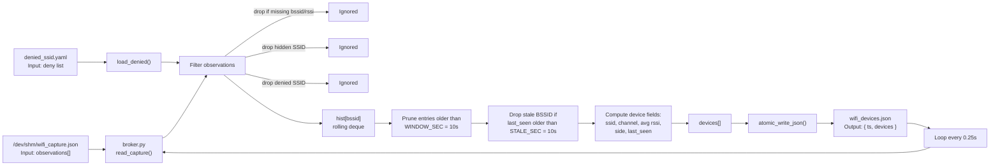
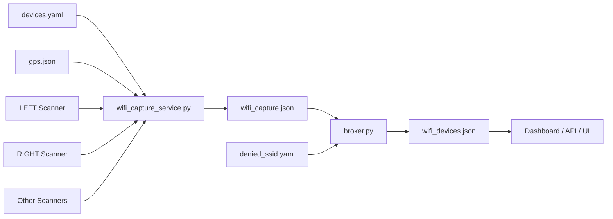

# broker.py

```mermaid

flowchart LR
    A["/dev/shm/wifi_capture.json<br/>Input: observations[]"] --> B["broker.py<br/>read_capture()"]

    D["denied_ssid.yaml<br/>Input: deny list"] --> C["load_denied()"]
    C --> E["Filter observations"]

    B --> E

    E -->|drop if missing bssid/rssi| X1["Ignored"]
    E -->|drop hidden SSID| X2["Ignored"]
    E -->|drop denied SSID| X3["Ignored"]

    E --> F["hist[bssid]<br/>rolling deque"]
    F --> G["Prune entries older than<br/>WINDOW_SEC = 10s"]
    G --> H["Drop stale BSSID if<br/>last_seen older than STALE_SEC = 10s"]

    H --> I["Compute device fields:<br/>ssid, channel, avg rssi,<br/>side, last_seen"]
    I --> J["devices[]"]

    J --> K["atomic_write_json()"]
    K --> L["wifi_devices.json<br/>Output: { ts, devices }"]

    M["Loop every 0.25s"] --> B
    L --> M
```
# wifi_capture_service.py

```mermaid
flowchart LR

    DEVICES["devices.yaml"] --> CAPTURE["wifi_capture_service.py"]

    GPS["gps.json"] --> CAPTURE

    LEFT["LEFT Scanner"] --> CAPTURE
    RIGHT["RIGHT Scanner"] --> CAPTURE
    OTHER["Other Scanners"] --> CAPTURE

    CAPTURE --> CAPTURE_JSON["wifi_capture.json"]

    CAPTURE_JSON --> BROKER["broker.py"]

    DENY["denied_ssid.yaml"] --> BROKER

    BROKER --> DEVICES_JSON["wifi_devices.json"]

    DEVICES_JSON --> UI["Dashboard / API / UI"]
```

---

## How It Works

This process is a collector and aggregator.

It:

Reads Wi-Fi observations from one or more serial-connected scanners.
Reads GPS metadata from gps.json.
Combines everything into a single snapshot.
Writes the snapshot to wifi_capture.json every 200 ms.

It does not perform filtering, deduplication, averaging, or direction calculations. That's what broker.py does later.

Startup
1. Load scanner configuration
ports = load_ports()

Reads:

devices.yaml

and builds a list like:

[
    {
        "node": "LEFT",
        "port": "/dev/ttyUSB0",
        "baud": 115200
    },
    {
        "node": "RIGHT",
        "port": "/dev/ttyUSB1",
        "baud": 115200
    }
]

These become scanner threads.

2. Create shared bus
bus = CaptureBus()

The bus contains:

self.buf

A rolling observation buffer:

deque(maxlen=2000)

and

self.status

Scanner health information.

3. Launch one thread per scanner
threading.Thread(
    target=capture_thread,
    ...
).start()

Example:

LEFT  -> thread
RIGHT -> thread

Each thread operates independently.

Scanner Thread Operation

Each scanner thread continuously tries to connect:

ser = serial.Serial(dev, baud)

If the scanner disappears:

USB unplugged
ESP32 reboot
Serial timeout

the thread marks itself disconnected and retries.

Reading Scanner Data

Each scanner sends JSON lines such as:

{
  "bssid":"AA:BB:CC:DD:EE:FF",
  "ssid":"Starbucks",
  "rssi":-61,
  "channel":6
}

The thread reads:

raw = ser.readline()

then:

pkt = json.loads(raw)
Validation

The packet is discarded unless:

bssid exists

and

rssi exists

This prevents junk packets from entering the system.

Observation Creation

A normalized observation is created:

obs = {
    "ts": time.time(),
    "node": node,
    "bssid": bssid,
    "ssid": ssid,
    "rssi": rssi,
    "channel": channel,
    "frequency": freq
}

Example:

{
  "ts": 1717966000.5,
  "node": "LEFT",
  "bssid": "AA:BB:CC:DD:EE:FF",
  "ssid": "Starbucks",
  "rssi": -61,
  "channel": 6,
  "frequency": 2437
}
Add to CaptureBus

The observation gets stored:

bus.add(obs)

inside:

deque(maxlen=2000)

This acts as a rolling buffer.

When full:

new observation arrives
↓
oldest observation removed

automatically.

Scanner Status Tracking

Each thread updates:

bus.set_status(...)

Example:

{
  "LEFT": {
    "port": "/dev/ttyUSB0",
    "connected": true,
    "last_error": null,
    "last_seen": 1717966000
  }
}

This lets the UI know whether scanners are alive.

Main Loop

After startup, the main thread runs forever:

while True:

Every:

FLUSH_MS = 200

milliseconds.

Read GPS
gps = read_gps()

Reads:

tmp/gps.json

produced by your GPS service.

If GPS is unavailable:

None

is returned.

The capture service continues operating normally.

Build GPS Block
build_gps_block(gps)

Normalizes GPS information.

Even when GPS is missing, it generates:

{
  "gps_valid": false,
  "gps_fix": "NO GPS DATA"
}

so downstream consumers always see the same schema.

Snapshot the Bus
observations, scanner_status = bus.snapshot()

This grabs:

list(self.buf)
dict(self.status)

under a lock.

Result:

observations

contains recent Wi-Fi packets.

and

scanner_status

contains scanner health.

Build Output Payload

The final object looks like:

{
  "ts": 1717966000.5,

  "gps": {
    ...
  },

  "scanner_status": {
    ...
  },

  "observations": [
    ...
  ]
}
Write Output File
atomic_write_json(
    "/dev/shm/wifi_capture.json",
    payload
)

creates:

wifi_capture.json.tmp

then:

os.replace(...)

atomically swaps it into place.

This guarantees readers never see:

partial JSON
truncated files
corrupt writes
What broker.py receives

Every ~200 ms, broker.py sees:

{
  "ts": ...,

  "gps": {...},

  "scanner_status": {...},

  "observations": [
    {
      "node":"LEFT",
      "bssid":"AA:BB:CC",
      "rssi":-62
    },
    {
      "node":"RIGHT",
      "bssid":"AA:BB:CC",
      "rssi":-70
    }
  ]
}

broker.py then:

Reads observations.
Groups by BSSID.
Maintains a 10-second history.
Computes average RSSI.
Computes LEFT vs RIGHT side.
Filters hidden and denied SSIDs.
Produces wifi_devices.json.

So in one sentence:

wifi_capture_service.py is the raw data ingestion layer that merges scanner feeds and GPS metadata into a single shared capture file, while broker.py is the analytics layer that converts those raw observations into a clean list of active Wi-Fi devices.
**Ensures ESP32 USB capture nodes stay responsive by detecting stalled data streams, safely resetting only the affected USB devices, and exposing status for dashboards.**
