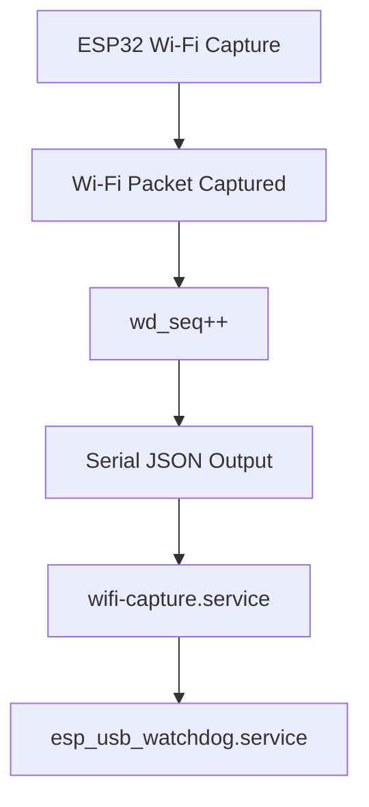

# ESP Watchdog Operation

This document describes **exactly** how the ESP watchdog works in the Wi‑Fi Promiscuous system.

The watchdog is **capture‑driven**, not time‑driven.

It answers one question only:

> **Is this ESP still capturing real Wi‑Fi traffic?**

---

## Core Principle

The watchdog does **not** care whether:

* the ESP is powered on
* the serial port is open
* the Wi‑Fi scan loop is running

The watchdog advances **only** when a real Wi‑Fi packet is captured.

If no packets are captured, the watchdog **must not move**.

This eliminates false positives.

---

## Watchdog Signal

Each ESP maintains a monotonic counter:

```
wd_seq
```

Rules:

* `wd_seq` increments **only** when a Wi‑Fi packet is captured
* `wd_seq` never resets during runtime
* `wd_seq` is emitted with every serial JSON message

Example JSON fragment:

```json
{
  "node": "LEFT",
  "esp_us": 1766698123456,
  "wd_seq": 8421,
  "rssi": -62,
  "bssid": "AA:BB:CC:DD:EE:FF"
}
```

---

## Data Flow (Watchdog Path)



---

## Host‑Side Watchdog Logic

The host watchdog (`esp_usb_watchdog.service`) performs **no packet inspection**.

For each ESP node:

1. Track the last observed `wd_seq`
2. Track the timestamp when it was last seen
3. On the next message:

   * if `wd_seq` increased → ESP is healthy
   * if `wd_seq` unchanged for too long → ESP is stalled

No timing assumptions are made on the ESP side.

---

## Why This Works

This design is robust against:

* idle RF environments
* blocked channels
* driver stalls
* serial noise
* scan loops that run but capture nothing

The watchdog triggers **only** when capture truly stops.

---

## What the Watchdog Does NOT Do

* does not restart ESPs blindly
* does not assume packets should always exist
* does not infer health from time alone
* does not depend on RSSI or channel

---

## Summary

* `wd_seq` is the single source of truth
* monotonic counter = capture proof
* host logic is simple and deterministic
* no false positives
* no race conditions

This watchdog model is intentionally minimal and correct.

